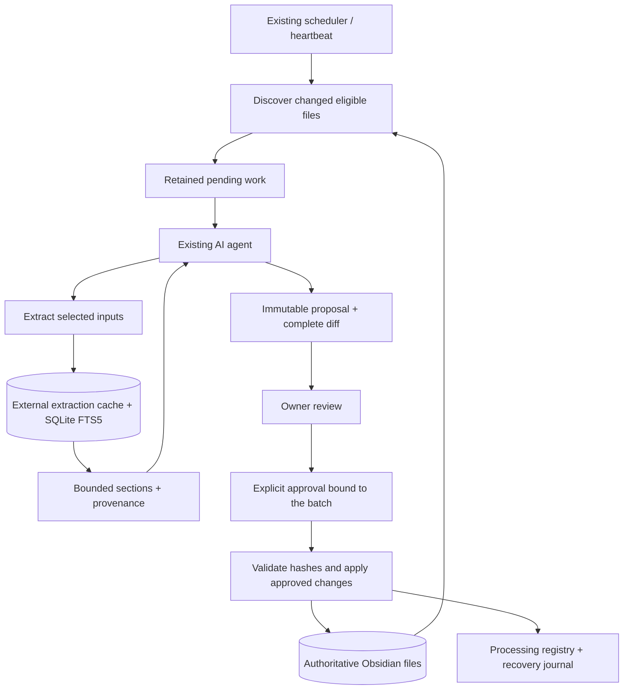

# Obsidian Retrieval

**Local evidence retrieval and explicitly approved note processing for Obsidian vaults.**

Obsidian Retrieval gives an AI agent a smaller, traceable view of a vault: discover changed inputs, extract only what is needed, retrieve relevant sections, and propose concrete note updates. The owner reviews the diff before anything is applied.

Obsidian files remain authoritative. SQLite indexes, extraction caches, proposals, and recovery data live outside the vault. Search starts with SQLite FTS5; no embedding service, vector database, or hosted index is required.

> **Status:** working personal deployment with automated tests and an owner-reported successful chat-approval trial. The desktop hook is tied to a reviewed app build. Full real-corpus accuracy, token-savings, and sync/recovery evaluation remain open; this is not a general-purpose production release.

## Why this exists

Agents often reread entire notes, processing logs, PDFs, and policy files for every task. That repeats work and fills the context window with material that has not changed.

This project separates three responsibilities:

- **Retrieval** returns bounded evidence with source revisions and locators.
- **Processing** turns selected evidence into one reviewable proposal, using an existing agent.
- **Scheduling** stays with the existing external heartbeat or scheduler.

The retrieval service does not write arbitrary notes or call an LLM. Approval covers the exact proposed changes, not ongoing permission to rewrite the vault.

## Features

- Incremental discovery with content hashes, change checkpoints, deletion handling, and full reconciliation.
- Fast scheduled intake that avoids extraction, OCR, and conversion before reporting pending work.
- Cached Markdown, DOCX, PPTX, and PDF extraction; optional local OCR and Office conversion/rendering.
- SQLite FTS5 search over titles, aliases, headings, and body text.
- Revision-scoped section reads, adjacent context, links/backlinks, source/output relationships, and processing status.
- JSON responses with token budgets, explicit truncation, and continuation cursors.
- Explicit allowlists, deny rules, code/sensitive-file exclusions, and optional policy-file fingerprinting.
- Concrete proposals containing complete output contents, diffs, source mappings, and processing-log updates.
- Chat-command approval through a verified desktop hook, or signed approval through the optional macOS app.
- Durable pending work, duplicate suppression, backups, conflict detection, and interrupted-application recovery.

## How it works



A normal run discovers changes, retrieves selected evidence, and delivers one proposal. An unchanged delivered proposal stays quiet. Failed or missed runs retain work for the next successful check.

## Requirements

- Python **3.12+** and [`uv`](https://docs.astral.sh/uv/).
- A SQLite build with FTS5 support.
- A local vault and a separate external state directory.
- An agent capable of calling the CLI and presenting complete review artifacts.
- Optional: **Tesseract** with the required language data for scanned PDFs.
- Optional: **LibreOffice** (`soffice`) for Office rendering and legacy document conversion.
- Optional: macOS and the supported desktop build for chat-hook approval, or a Secure Enclave-capable Mac for the native signing app.

Dependencies are locked in `uv.lock`. Missing extraction/rendering tools produce visible failures; they do not authorize processing incomplete evidence. Original documents are preserved.

## Quick start

Start with a disposable sample vault before connecting personal notes.

```sh
git clone https://github.com/redrum2k/obsidian_retrieval.git
cd obsidian_retrieval
uv sync --locked
cp examples/config.json config.local.json
```

The repository is private; cloning requires access. Edit `config.local.json` with existing absolute vault/state paths, allowed input roots, exclusions, output folders, and grounding conventions. Keep state outside the vault and synced directories. The sample config is disabled by default.

```sh
# Validate configuration without initializing an index or extracting sources.
uv run vault --config config.local.json validate
```

After reviewing the configuration, set `enabled` to `true`, then discover work:

```sh
uv run vault --config config.local.json intake --quiet
uv run vault --config config.local.json pending
uv run vault --config config.local.json health

# Select IDs returned by pending; this step may invoke OCR or conversion.
uv run vault --config config.local.json extract --ids DOCUMENT_ID
uv run vault --config config.local.json search --query 'your topic'
```

`intake --quiet` can intentionally print nothing when no host action is needed. It does not perform expensive extraction. `refresh` can extract eligible inputs, and `refresh --full` additionally reconciles content hashes; neither should replace discovery-only intake in a routine scheduled check.

For offline use, populate the tokenizer cache while online:

```sh
uv run python -c 'import tiktoken; tiktoken.get_encoding("cl100k_base")'
```

The initial tokenizer download does not transmit vault contents. Retrieval itself is local; an external agent host may send retrieved evidence to its configured model.

## Configuration

[examples/config.json](examples/config.json) is the portable starting point. The [deployment example](examples/live-config.proposed.json) and [live-configuration guide](docs/live-configuration.md) describe this project's personal installation and should not be copied blindly.

| Setting | Purpose |
| --- | --- |
| `vault`, `state` | Authoritative source directory and separate private runtime storage |
| `roots`, `glossary` | Explicitly admitted source areas and glossary inputs |
| `exclude` | Deny rules; exclusions take precedence over admission |
| `outputs`, `companion_roots` | Destinations for approved notes and labeled derived companions |
| `input_rules` | Admission patterns for new files of known shapes |
| `user_note_paths`, `integration_permissions` | Grounding conventions and explicit named-source exceptions |
| `processing_log`, `operational_files` | Existing registry and specifically admitted workflow files |
| `policy` | Optional policy path and reviewed content fingerprint |
| `approval_scheme` | Chat-hook or signed-receipt approval mechanism |

Input admission permits retrieval, not automatic note generation. Context-only readings need an appropriate user-note anchor or explicit integration permission before they can initiate processing. Unknown source roles and missing processing mappings are not inferred as authorization.

The agent must still read applicable `AGENTS.md` instructions. A pinned policy hash catches changes; it does not replace policy interpretation. Never update a policy fingerprint merely to suppress an error.

## CLI reference

Run `uv run vault --help` or `uv run vault COMMAND --help` for flags.

| Commands | Responsibility |
| --- | --- |
| `validate`, `health` | Configuration and operational status |
| `intake`, `pending`, `notifications` | Discover changes, retain work, and expose undelivered proposals |
| `extract`, `visual` | Extract selected documents and locate cached visual artifacts |
| `search`, `read-sections`, `neighbors` | Retrieve bounded evidence and relationships |
| `changes`, `processing-status` | Inspect source changes and processing provenance |
| `propose`, `acknowledge` | Persist a concrete plan and record its actual delivery |
| `apply-hook` | Apply a batch with an existing valid hook approval |
| `approval-request`, `apply` | Export a native review request and apply a signed receipt |
| `refresh`, `rebuild` | Reconcile sources or rebuild derived search data |
| `schedule` | Inspect the deployment's default recurrence; installs no scheduler |

Examples:

```sh
uv run vault --config config.local.json search --query 'row operations' --project sample
uv run vault --config config.local.json read-sections --ids SECTION_ID --budget 4000
uv run vault --config config.local.json neighbors --id SECTION_ID --relation adjacent
uv run vault --config config.local.json processing-status --ids DOCUMENT_ID
uv run vault --config config.local.json changes --since 0
```

Responses use JSON and a pinned local tokenizer. Default budgets are 2,000 tokens, or 4,000 for section reads, with up to 8 items. Accepted budgets range from 256 to 8,000 tokens; calls accept at most 20 items/IDs. Metadata and errors count toward the response budget. Follow returned continuations using the same operation and filters; do not treat truncated output as a complete result.

Evidence includes source revisions and locators. The service verifies source freshness before returning cached evidence; stale content is not silently presented as current. Ranking scores are ordering signals, not confidence probabilities. CLI errors use exit code 2; successful CLI requests use 0.

## Review and approval

The agent uses the [plan schema](docs/host-integration.md) to supply source revisions, exact output contents, expected target hashes, provenance, and uncertainties. The coordinator adds the matching registry update.

```sh
uv run vault --config config.local.json propose --plan plan.json
uv run vault --config config.local.json notifications

# Only after the complete review artifact is delivered in this conversation:
uv run vault --config config.local.json acknowledge \
  --id PROPOSAL_ID --session-id CONFIGURED_SESSION_ID
```

`--plan -` also accepts JSON on stdin. Proposal creation and acknowledgment do not write vault notes.

### Chat approval

Follow [hook-approval-setup.md](docs/hook-approval-setup.md) for this deployment. Hook examples contain installation-specific paths; replace them for another checkout.

After reviewing a delivered proposal, the owner sends this as **plain text in the configured conversation**:

```text
IMPLEMENT FULL_PROPOSAL_ID
```

The hook checks the exact command, conversation, delivery record, immutable proposal/configuration digest, and source/target conditions. It records approval and instructs the same agent turn to execute `apply-hook`. No separate receipt handoff is needed. Recording approval is not completion: the agent must report the actual application result.

The hook is bound to reviewed desktop build fingerprints. Host upgrades stop approval until compatibility is revalidated. These checks are local workflow controls, not cryptographic authentication against unrestricted same-user code. The [host evidence](docs/hook-host-evidence.md) distinguishes source inspection, fixture tests, and the live pilot.

### Signed approval

The optional [macOS approval app](docs/approval-adapter.md) reviews the exact request and signs it using an owner-enrolled Secure Enclave key. The CLI also supports Ed25519 receipt verification. The private signing material is not part of this repository.

```sh
uv run vault --config config.local.json approval-request --id PROPOSAL_ID
# Review and approve using the configured trusted signing app.
uv run vault --config config.local.json apply --id PROPOSAL_ID --receipt /private/path/receipt.json
```

Switching approval schemes or changing configuration invalidates old proposals. Regenerate the diff and obtain fresh approval; there is no `--approved` flag or blanket autonomous-writing mode.

## Connect an existing heartbeat

Use the [complete heartbeat prompt](docs/heartbeat-prompt.md) and [connection guide](docs/connection-and-evaluation.md). The supplied prompt is specific to the existing personal deployment; adapt its paths, conversation ID, policy, and narrowly scoped attachment exception before reuse elsewhere.

The external scheduler owns trigger times and daylight-saving behavior. This project creates no duplicate scheduler. Scheduled runs prepare proposals; they never authorize application. Keep source discovery, selective extraction, planning, delivery, and approval as distinct steps.

## Safety, recovery, and private data

- Originals, code/infrastructure, sensitive documents, and unauthorized attachments remain protected. Symlinks and hardlinks are conservatively rejected.
- Approved writes validate all preconditions before mutation, stage changes, preserve backups and competing versions, and publish the registry action last.
- Multi-file application is **not an atomic transaction across Obsidian, sync tools, or other editors**. Existing destinations can be briefly absent during publication. See [write-safety.md](docs/write-safety.md) for precise guarantees and recovery behavior.
- Retry an interrupted batch only through its recorded approval and recovery path. Divergent content requires a newly reviewed proposal; do not overwrite newer files with backups.
- Use `rebuild` for search reconstruction. Do not delete all state: pending proposals, approvals, and recovery history are not disposable caches. Automated retention/expiry is not configured.
- Keep local configuration, keys, key exports, approval receipts, databases, extracted text, proposal artifacts, and backups out of Git. Runtime state can contain complete private source text. `.gitignore` covers common local artifacts but cannot replace review of staged changes.

The committed examples use empty values/placeholders; tests generate disposable keys at runtime. Host-build fingerprints are checksums of application files, not approval keys.

## Development and validation

```sh
uv sync --locked
uv run pytest -q
uv run ruff check src tests examples
uv run ruff format --check src tests examples

# Optional native review tests on macOS:
bash approval-app/test.sh

# Synthetic measurements; these do not establish production accuracy or savings.
uv run python examples/evaluate.py --output /tmp/vault-evaluation.json
uv run python examples/benchmark_intake.py --output /tmp/vault-intake-benchmark.json
```

Tests cover exclusions, incremental indexing, extraction reuse, response budgets, stale evidence, registry preservation, approved creation/update, conflicting edits, interruption/retry, hook matching, and unchanged-run silence. Real-corpus acceptance still requires representative labeled tasks and complete agent traces; see the [evaluation procedure](docs/connection-and-evaluation.md#measure-actual-benefit).

## Project layout

```text
src/vault_retrieval/
  cli.py                 CLI and bounded operation dispatch
  config.py              Eligibility and safe file access
  service.py             Inventory, indexing, and retrieval
  extract.py             Local extraction and cached artifacts
  store.py               SQLite state and coordination
  coordinator.py         Intake, proposals, and approved batches
  registry.py             Processing-log compatibility
  writes.py              Publication and recovery
  hook*.py               Desktop approval integration
  approval.py            Signed-receipt verification and export
approval-app/            Optional native macOS review/signing app
examples/                Configuration templates and synthetic evaluations
tests/                   Isolated regression tests
docs/                   Setup, integration, evidence, and design notes
```

## Documentation

- [Product requirements](prd.md) and [original architecture proposal](architecture-proposal.md)
- [Agent integration and plan schema](docs/host-integration.md)
- [Hook activation and troubleshooting](docs/hook-approval-setup.md)
- [Complete heartbeat prompt](docs/heartbeat-prompt.md)
- [Native approval app](docs/approval-adapter.md)
- [Write safety and recovery](docs/write-safety.md)
- [Implementation status](docs/implementation-status.md)
- [Code-quality and intake performance review](docs/code-quality-review.md)

Some design and deployment notes preserve historical decisions. For current installation steps, start with this README and the hook activation guide.

## Scope and licensing

This is a single-user local tool, not a hosted service or Obsidian plugin. Embeddings, autonomous note writing, generalized multi-user support, and automatic source reorganization are outside the current scope. Additional search complexity should be justified by measured retrieval failures.

No project license has been declared. Dependencies retain their own licenses; PyMuPDF is distributed under AGPL/commercial terms. Consult dependency licensing before redistribution.
